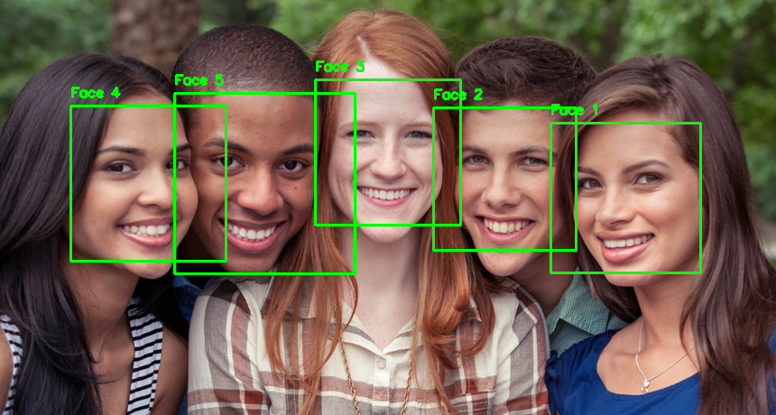

# Face Counter

This project provides a Python script for counting faces in an image and a web application to visualize the count and highlight the faces in the image.

## [Link to the Website](https://facecounter.onrender.com) (Hosted on Render)

## Project Flowchart


## Example

### Input Image


### Output Image



## Installation

1. Clone the repo

   ```bash
   git clone https://github.com/Hardvan/FaceCounter
   ```

2. Navigate to the folder

   ```bash
   cd FaceCounter
   ```

3. Create a virtual python environment by typing the following in the terminal

   ```bash
   python -m venv .venv
   ```

4. Activate the virtual environment

   Windows:

   ```bash
   .\.venv\Scripts\activate
   ```

   Linux:

   ```bash
   source .venv/bin/activate
   ```

5. Install dependencies by typing the following in the terminal

   ```bash
   pip install -r requirements.txt
   ```

6. Run the app

   ```bash
   python app.py
   ```

7. Click on the link in the terminal to open the website

   It will look something like this:

   ```bash
   Running on http://127.0.0.1:5000
   ```

### Testing the CountFaces.py script

If you want to test the script, you can run the following command in the terminal:

```bash
python CountFaces.py
```

This will run the script on the image in the `images` folder and print the number of faces found in the image along with storing the image with the faces highlighted in the `output` folder.
